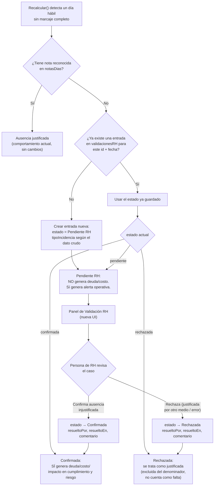

# Diseño del Flujo de Validación RH (Fase 5) — Propuesta funcional, NO implementada

> Generado con IA (Claude — ERC AI Workspace) | Propiedad ERC Capital Corp | Requiere validación del responsable.
> Fecha: 2026-09-04 | Fase 5 de "Implementación de Mejoras Post-Auditoría" — **diseño únicamente,
> sin ningún cambio en `dashboard-asistencia-working.html`.**

## 1. Resumen

Formaliza, como propuesta funcional y técnica, la decisión de negocio ya tomada el 2026-09-04 (ver
`PROJECT_CONTEXT.md` y `CHANGELOG.md`): **falta de marcaje, marcaje incompleto, olvido de entrada y
olvido de salida no deben generar automáticamente horas pendientes, deuda ni costo perdido.** Deben
quedar como **"Pendientes de Validación RH"**, visibles como alerta operativa, hasta que una
persona de RH confirme si se trata de una ausencia injustificada real. Solo esa confirmación
explícita debe generar impacto en horas pendientes, costo, nómina, cumplimiento y riesgo del
colaborador.

Este documento cubre: modelo de datos, estados y clasificaciones, flujo de aprobación, mockup
conceptual de la UI de RH, impacto sobre KPIs existentes y sobre el Dashboard Ejecutivo. **No se
modifica ninguna fórmula productiva como parte de este documento.**

## 2. Estados

| Estado | Significado | Genera deuda/costo/impacto |
|---|---|---|
| **Pendiente RH** | Incidencia detectada automáticamente, sin resolver todavía. Estado inicial de toda incidencia sin nota reconocida. | ❌ No — solo alerta operativa. |
| **Confirmada** | RH revisó y determinó que es una ausencia injustificada real. | ✅ Sí — deuda, costo, nómina, cumplimiento, riesgo. |
| **Rechazada** | RH revisó y determinó que NO es una ausencia real (justificada por otro medio, error de marcaje, dato incompleto por causa ajena al colaborador, etc.). | ❌ No — se trata igual que un día con nota reconocida (excluido del denominador de Asistencia, no como falta). |

Toda incidencia nace en **Pendiente RH** y transiciona una sola vez a **Confirmada** o
**Rechazada** (transición manual, no automática — ver flujo en la sección 5). No se contempla
"reabrir" en esta primera versión; si se necesita corregir una validación ya hecha, es una edición
directa del registro por un administrador, no una transición de estado nueva.

## 3. Clasificaciones (`tipo_incidencia`)

Reutiliza exactamente la taxonomía ya usada en `attendance_auditor.py`
(`clasificar_incidencia()`, ver `docs/dashboard-asistencia/auditor/attendance_auditor.py`) — no se
inventa una nueva:

| Clasificación | Cómo se detecta hoy (dato crudo) |
|---|---|
| **Falta de marcaje** | Día hábil sin ninguna fila de marcaje para el colaborador. |
| **Marcaje incompleto** | Existe una fila, pero con un solo valor de hora repetido en entrada y salida (hallazgo real de `attendance_auditor.py`: el archivo fuente no distingue "olvido de entrada" de "olvido de salida" — ambos se ven idénticos, `entrada == salida`). |
| **Olvido de entrada** | Subcaso de "marcaje incompleto" — **solo distinguible si en el futuro se recibe una fuente de datos que sí diferencie qué campo faltó** (hoy no es posible con `ReporteUnificadoEne-Ago.xlsx`, ver limitación documentada en el auditor). |
| **Olvido de salida** | Igual que arriba — mismo bloqueo de datos. |
| **Ausencia injustificada** | Resultado de una "Falta de marcaje" que RH **confirma** como real (transición a estado Confirmada). |
| **Ausencia justificada** | Día con nota reconocida en `notasDias` (Vacaciones, IGSS, permiso, Home Office, Comisión, Capacitación, suspensión autorizada) — este caso **ya existe hoy** y no cambia; nunca entra al flujo de validación RH porque ya tiene una explicación automática. |

**Limitación heredada y explícita:** mientras la fuente de datos sea `ReporteUnificadoEne-Ago.xlsx`
(o un reloj biométrico equivalente que registre "primera/última perforación" sin distinguir cuál
campo faltó), "Olvido de entrada" y "Olvido de salida" **no pueden diferenciarse automáticamente**
de "Marcaje incompleto" — la UI de RH debe permitir que la persona que valida elija manualmente
cuál de las dos aplica, a partir de su propio conocimiento del caso (ej. contactar al colaborador),
no que el sistema lo infiera solo.

## 4. Modelo de datos

Nueva estructura en memoria, **separada de `notasDias`** (que sigue existiendo sin cambios, para
motivos ya reconocidos automáticamente):

```js
// Clave: `${colaboradorId}_${fechaISO}` — mismo patrón de clave que notasDias, por consistencia.
const validacionesRH = {
  "960444_2026-03-12": {
    tipoIncidencia: "falta_marcaje",       // falta_marcaje | marcaje_incompleto | olvido_entrada | olvido_salida
    estado: "pendiente",                    // pendiente | confirmada | rechazada
    detectadoEn: "2026-09-04T10:00:00Z",    // timestamp de cuando el sistema la detectó
    resueltoPor: null,                      // nombre/usuario de quien valida (null mientras esté pendiente)
    resueltoEn: null,
    comentarioRH: ""                        // texto libre opcional, ej. "Confirmado con el colaborador, no presentó permiso"
  }
  // ...una entrada por cada día hábil sin marcaje y sin nota reconocida existente hoy en notasDias
};
```

**Por qué una estructura nueva y no extender `notasDias`:** `notasDias` representa "motivo
declarado" (con o sin evidencia, alimentado también por el archivo de Permisos/Vacaciones) —
mezclar ahí el estado de un flujo de aprobación (quién, cuándo, con qué resultado) sobrecargaría su
propósito actual y complicaría toda la lógica que ya depende de que `notasDias[key]` sea
simplemente "hay o no hay una nota". `validacionesRH` es un mecanismo de workflow, `notasDias` sigue
siendo un mecanismo de clasificación — se consultan juntos, no se fusionan.

**Persistencia:** como el resto del sistema, vive en memoria del navegador mientras no exista
backend (ver "Sin persistencia" en `PROJECT_CONTEXT.md`). Esto es una limitación real del diseño
actual: si RH valida incidencias y la página se recarga antes de exportar/guardar, se pierde el
trabajo — igual que ya ocurre hoy con `notasDias` y `ajustes`. Se recomienda, como parte de esta
misma fase de implementación futura, agregar exportación/importación de `validacionesRH` a
JSON/CSV (mismo patrón que ya existe para otras exportaciones), para que RH no dependa de no cerrar
el navegador.

## 5. Flujo de aprobación



**Puntos clave del flujo:**
- La detección (paso A-E) ocurre automáticamente cada vez que se recalcula, igual que hoy — no
  requiere acción de RH para aparecer como alerta.
- El impacto financiero (paso J) solo ocurre **después** de una acción humana explícita — nunca
  antes. Esto es exactamente la regla de negocio del 2026-09-04.
- Una vez resuelta (Confirmada o Rechazada), la incidencia **no vuelve a aparecer** en el panel de
  pendientes — pero su registro permanece en `validacionesRH` para trazabilidad/auditoría (quién,
  cuándo, por qué).

## 6. Mockup conceptual — Panel de Validación RH

Nueva pestaña o sección dentro del administrativo (`dashboard-asistencia-working.html`), visible
solo cuando hay al menos una incidencia Pendiente RH. Estructura conceptual (sin código, solo
layout):

```
┌─────────────────────────────────────────────────────────────────────────┐
│  Validación de Incidencias RH                    [ 14 pendientes ]      │
│  Período: [ Todos los meses ▾ ]   Departamento: [ Todos ▾ ]              │
├─────────────────────────────────────────────────────────────────────────┤
│ ☐ │ Colaborador          │ Depto      │ Fecha      │ Tipo          │ Acción      │
├───┼───────────────────────┼────────────┼────────────┼───────────────┼─────────────┤
│ ☐ │ José López            │ Finanzas   │ 2026-03-12 │ Falta marcaje │ [Confirmar] [Rechazar] [Nota] │
│ ☐ │ Ana García            │ TI         │ 2026-04-02 │ Marcaje incompleto │ [Confirmar] [Rechazar] [Nota] │
│ ☐ │ ...                   │ ...        │ ...        │ ...           │ ...         │
├─────────────────────────────────────────────────────────────────────────┤
│ Con ☐ seleccionados: [ Confirmar seleccionados ]  [ Rechazar seleccionados ] │
└─────────────────────────────────────────────────────────────────────────┘
```

- **Filtros:** Período y Departamento, igual que el resto del sistema — reutiliza los mismos
  controles y el mismo estado de filtro que ya existen, no se inventa un componente nuevo.
- **Acción individual:** "Confirmar" y "Rechazar" abren un modal simple (reutiliza el patrón de
  modal ya existente para notas manuales) para capturar el comentario opcional antes de guardar.
- **Acción en lote:** casilla de selección múltiple + botones "Confirmar seleccionados" /
  "Rechazar seleccionados" — útil para RH cuando ya investigó varios casos similares (ej. un corte
  de energía que afectó el reloj biométrico un día completo).
- **Al cambiar de estado**, la fila desaparece de este panel inmediatamente (ya no está pendiente)
  y el contador del encabezado se actualiza.

## 7. Impacto sobre KPIs existentes

| KPI / mecanismo | Cambio requerido |
|---|---|
| `calcByEmp()` — bloque de ausencia (`dashboard-asistencia-working.html:3068`) | Deja de sumar 480 min automáticamente para todo día sin marcaje sin nota. Pasa a sumar 480 min **solo** si `validacionesRH[key].estado === 'confirmada'`. Si es `'pendiente'` o `'rechazada'`, no suma nada (comportamiento actual del "hallazgo de 480 hardcodeado", tarea de Baja prioridad #15, se resuelve como efecto colateral de este cambio: al reescribir este bloque, se aprovecha para usar `jornadaMin` en vez del valor fijo). |
| `avgJornada` (cumplimiento) | **Gap estructural ya documentado** (`PROJECT_CONTEXT.md`): hoy solo promedia días con marcaje real, nunca baja por una ausencia. Debe extenderse para que un día con `estado === 'confirmada'` cuente como 0% de jornada en el promedio (no solo generar deuda aparte). Es el cambio de mayor alcance de todo el diseño — afecta Resumen General, Detalle por Colaborador y Dashboard Ejecutivo por igual, porque los tres consumen la misma función. |
| "Costo Total Perdido" / "Impacto sobre Nómina" (Dashboard Ejecutivo) | Bajan mientras existan incidencias sin confirmar — es el efecto **buscado** por esta fase, no un error. Debe comunicarse explícitamente a Gerencia (ver punto 8) para que no se interprete como "mejoró la asistencia" cuando en realidad es "hay incidencias sin validar". |
| "Colaboradores de Riesgo" (<80% cumplimiento) | Cambia de significado una vez `avgJornada` se redefina (ausencias confirmadas sí bajan el promedio) — requiere re-validar el umbral de 80% con datos reales después del cambio, no asumir que sigue siendo el punto de corte correcto. |
| Panel "Requiere atención" (`atencionCandidatos`, `dashboard-asistencia-working.html:3575-3611`) | Ya calcula hoy la población correcta de "días sin marcaje sin motivo" — es reutilizable como base de la lista que alimenta el nuevo Panel de Validación RH (sección 6), evitando duplicar esa consulta. |
| **Nuevo indicador: "Pendientes de Validación RH"** | Contador nuevo, visible en Resumen General (junto a "Requiere atención") y en el Dashboard Ejecutivo (ver punto 8) — cuántas incidencias existen hoy en estado `pendiente`, para que nadie asuma que "Costo Total Perdido" ya refleja el 100% de la realidad mientras haya pendientes sin resolver. |

## 8. Impacto sobre el Dashboard Ejecutivo

- **Nuevo indicador de contexto**, junto a los 4 KPIs (sin ser un 5º KPI de igual jerarquía, para no
  violar el máximo de 4 recomendado por `AI_DASHBOARD_PLAYBOOK.md`): "X incidencias pendientes de
  validación RH — el Costo Total Perdido puede aumentar al resolverse." Rol equivalente al que hoy
  cumple "Oportunidad de Recuperación": informativo, no uno de los 4 KPIs principales.
- **"Detalle por Día" (Fase 2, ya implementada):** la columna **"Estado"** que pide esa fase encaja
  exactamente aquí — valores: `Presencial`, `Justificada`, `Pendiente RH`, `Confirmada`,
  `Rechazada`. No se necesita una columna nueva, la que ya está planeada para Fase 2 cubre este
  caso si se implementa con esos 5 valores posibles.
- **El Dashboard Ejecutivo (archivo separado, descargado) es de solo lectura para Gerencia** — la
  validación RH ocurre en el administrativo, nunca en el archivo ejecutivo ya generado. Esto es
  consistente con la arquitectura actual (Administrativo = edición, Ejecutivo = consumo).

## 9. Alcance NO cubierto por este documento (decisiones pendientes del responsable)

1. ¿Quién tiene permiso para confirmar/rechazar? Hoy el sistema no tiene roles de usuario — se
   asume que cualquiera con acceso al administrativo puede validar. Si se requiere restricción por
   rol, es una decisión de negocio adicional, fuera del alcance de este diseño.
2. ¿Se requiere notificación (correo, alerta) cuando una incidencia queda pendiente por más de N
   días? No contemplado en esta primera versión.
3. Exportación/respaldo de `validacionesRH` fuera de la sesión del navegador (ver limitación de
   persistencia, sección 4) — recomendado pero no diseñado en detalle aquí.
4. El umbral exacto de "Colaboradores de Riesgo" tras redefinir `avgJornada` (sección 7) requiere
   una corrida con datos reales una vez implementado, no puede definirse solo en el diseño.

## 10. Siguiente paso

Este documento es la propuesta funcional y técnica completa. **No se implementa código hasta que
el responsable apruebe explícitamente este diseño** (por instrucción explícita de esta fase). Al
aprobarse, la implementación real debe planificarse con `feature-planning` en tareas discretas
(el propio `NEXT_TASKS.md`, Alta prioridad #2, ya anticipa que el alcance es mayor al estimado
inicialmente) — este documento es el insumo de esa planificación, no la sustituye.
